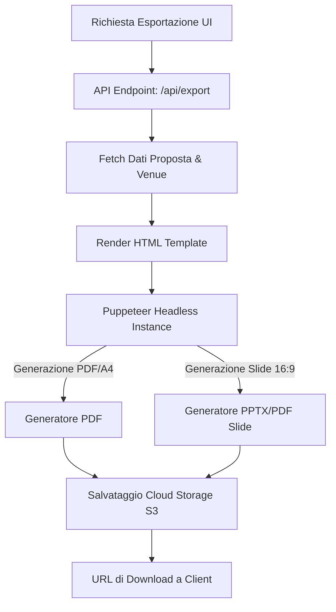

# Specifica Tecnica - Esportazione PDF e Presentazioni B2B

Questo documento fornisce le specifiche per la futura implementazione del motore di esportazione PDF e presentazioni all'interno di ZAK.

---

## 1. Architettura della Pipeline di Esportazione

L'esportazione di proposte B2B in formato PDF o slide utilizzera' un approccio basato su **Headless Browser Rendering** (tramite Puppeteer) per garantire massima fedelta' grafica e uniformita' di stile tra il mockup web e il documento generato.



---

## 2. Struttura del Documento (Sezioni Richieste)

Ogni esportazione deve generare un documento composto da almeno 5 sezioni/slide standard:

### A. Copertina (Slide 1)
* **Contenuto:** Titolo della proposta, nome del partner target, logo della venue, data di generazione, nome dello staff manager di riferimento.
* **Stile:** Sfondo scuro a forte contrasto, tipografia moderna (es. Outfit o Inter bold), logo in risalto.

### B. Descrizione dell'Offerta (Slide 2)
* **Contenuto:** Riepilogo narrativo dell'evento (messaggio principale) e lista dettagliata dei servizi inclusi (noleggio, allestimenti, buffet, coordinatore di sala).
* **Stile:** Layout a due colonne: testo descrittivo a sinistra, icone dei servizi inclusi a destra.

### C. Confronto Competitivo (Slide 3)
* **Contenuto:** Tabella comparativa semplificata che mostra il nostro posizionamento di prezzo, tempi di risposta rapidi e automazioni incluse rispetto ai competitor principali rilevati in zona.
* **Stile:** Griglia di comparazione con spunte verdi e croci rosse, per evidenziare visivamente la superiorita' operativa della nostra venue.

### D. Pricing & Condizioni Commerciali (Slide 4)
* **Contenuto:** Dettaglio dei costi suddiviso in affitto base, quota catering a persona, servizi extra e totale complessivo stimato (con indicazione IVA). Note su validita' dell'offerta e modalita' di acconto.
* **Stile:** Tabella dei prezzi pulita con totale evidenziato in colore accentuato (es. Indigo/Indigo-Dark).

### E. Call to Action & Contatti (Slide 5)
* **Contenuto:** Passi successivi per la conferma (es. firma digitale o chat WhatsApp diretta). QR code che punta al link di accettazione del preventivo sul portale ZAK.
* **Stile:** Elemento CTA centrale molto visibile, contatti telefonici e pulsanti interattivi.

---

## 3. Specifiche di Rendering e Paginazione CSS

Per l'esportazione PDF (A4), verranno applicate le seguenti regole CSS di stampa (Print Stylesheet):

```css
@media print {
  body {
    background: white;
    color: black;
    font-family: 'Inter', sans-serif;
  }
  .page-break {
    page-break-after: always;
  }
  @page {
    size: A4 portrait;
    margin: 20mm;
  }
}
```

Per l'esportazione Presentazione (Slide), la dimensione di rendering sara' forzata a risoluzione 16:9 (`1920px` x `1080px`) con orientamento orizzontale:

```css
@page {
  size: 297mm 210mm; /* A4 Orizzontale per compatibilita' stampa slide */
  margin: 0;
}
```
